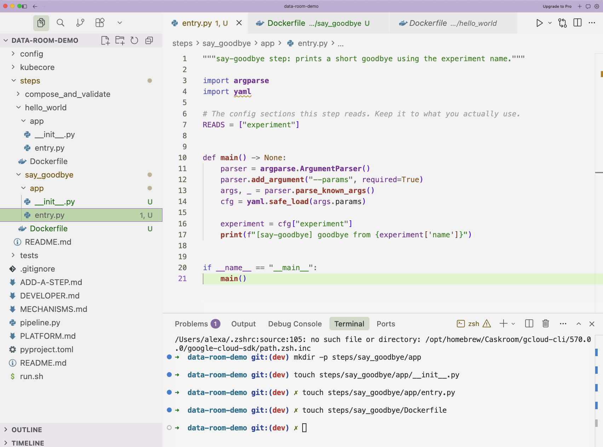
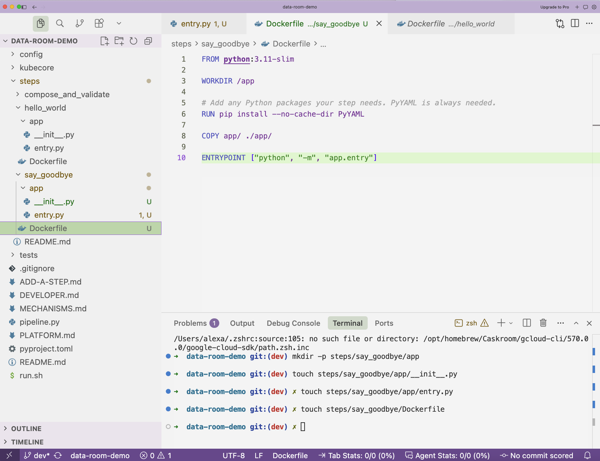
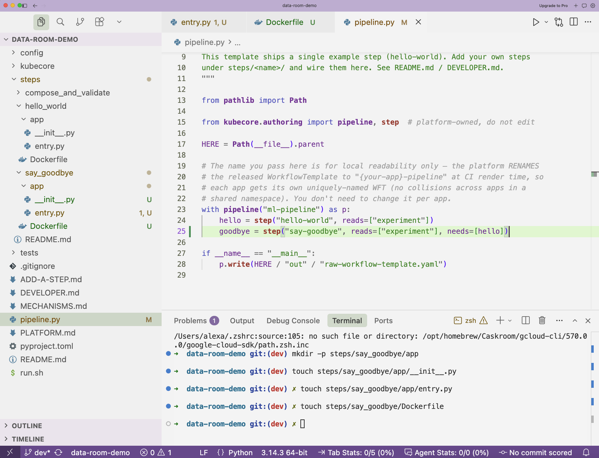

# Add a step

This is the main page. Follow it top to bottom. By the end you will have a brand new step in your pipeline.

We will add a step called **`say-goodbye`**. It runs after the step that ships with the template. Swap in your own name and your own code once you are comfortable.

!!! warning "The naming rule. Read this once."
    A step has two names and they look slightly different.

    - The step name uses dashes. Example: `say-goodbye`.
    - The folder name uses underscores. Example: `steps/say_goodbye`.

    Same word. One uses dashes, the other uses underscores. Get this right and everything else falls into place. The platform matches them for you.

## What you will touch

Only these. Nothing else.

| File | Why |
|---|---|
| `steps/say_goodbye/app/entry.py` | the code your step runs |
| `steps/say_goodbye/app/__init__.py` | an empty file that marks a Python package |
| `steps/say_goodbye/Dockerfile` | how your step gets packed into a box |
| `pipeline.py` | one line that adds the step to the list |

You will not open anything inside `kubecore/`. That is the platform engine. Leave it alone.

## Step 1. Make the folder

Open your Terminal. Move into the project folder if you are not already there. Then run these two lines.

```bash
mkdir -p steps/say_goodbye/app
touch steps/say_goodbye/app/__init__.py
```

The first line makes the folders. The second makes an empty file called `__init__.py`. Leave that file empty. It just tells Python this is a package.



## Step 2. Write the code

Create a file at `steps/say_goodbye/app/entry.py`. In Visual Studio Code, right click the `app` folder, choose New File, and name it `entry.py`.

Paste this in exactly.

```python
"""say-goodbye step: prints a short goodbye using the experiment name."""

import argparse
import yaml

# The config sections this step reads. Keep it to what you actually use.
READS = ["experiment"]


def main() -> None:
    parser = argparse.ArgumentParser()
    parser.add_argument("--params", required=True)
    args, _ = parser.parse_known_args()
    cfg = yaml.safe_load(args.params)

    experiment = cfg["experiment"]
    print(f"[say-goodbye] goodbye from {experiment['name']}")


if __name__ == "__main__":
    main()
```

What this does, in plain words. The step receives all the settings as one big text value called `--params`. It reads the `experiment` section. It prints a line. That is a fine first step. Replace the print with your real work later.

!!! note "Where do settings come from?"
    Every setting in your `config/` folder arrives here inside `cfg`. You reach a section by name, like `cfg["experiment"]`. You do not fetch anything from a server. It is all handed to you.

## Step 3. Write the Dockerfile

Create a file at `steps/say_goodbye/Dockerfile`. No file extension. Just `Dockerfile`.

Paste this in exactly.

```dockerfile
FROM python:3.11-slim

WORKDIR /app

# Add any Python packages your step needs. PyYAML is always needed.
RUN pip install --no-cache-dir PyYAML

COPY app/ ./app/

ENTRYPOINT ["python", "-m", "app.entry"]
```



That is the whole Dockerfile. The platform uses it to build your step into an image. You never write an image name. You never write a registry address. The platform does that part.

!!! warning "The most common mistake"
    People add the step to `pipeline.py` but forget the Dockerfile. The check on your request catches it and tells you exactly which file is missing. So you find out early, not in the middle of a run.

## Step 4. Add the step to your pipeline

Open `pipeline.py`. You will see something like this.

```python
with pipeline("ml-pipeline") as p:
    hello = step("hello-world", reads=["experiment"])
```

Add one line for your new step. Make it run after the first step by pointing `needs` at it.

```python
with pipeline("ml-pipeline") as p:
    hello = step("hello-world", reads=["experiment"])
    goodbye = step("say-goodbye", reads=["experiment"], needs=[hello])
```



Here is what each part means.

- `"say-goodbye"` is the step name. Dashes, remember.
- `reads=["experiment"]` lists the settings your code reads. It must match the `READS` line in your `entry.py`.
- `needs=[hello]` means run after the `hello` step. This one line is how you set the order.

!!! note "A small ordering trap"
    `needs=[hello]` points at the `hello` line above it. So the step you depend on must be written above yours in the file. If you get it wrong you will see a clear error that names the missing word. Nothing breaks silently.

## Step 5. Check it on your computer (optional)

You do not need a cluster to sanity check your work. From the project folder, run this.

```bash
./run.sh
```

This renders your pipeline the same way the platform will. It does not run it. Running only happens later, from the web page. If your step shows up with no errors, you are in good shape. If you made a typo, this tells you in plain words.

## You are done editing

That is the whole job. You made a folder, wrote a small program, wrote a Dockerfile, and added one line. 

Next you will send this in and watch it get checked. Go to [Send your change in](send-it-in.md).

!!! tip "Need one step to hand data to the next?"
    Steps do not share a disk. If a step needs a result from the step before it, the first step writes a small file and declares it as an output. The next step receives it automatically. See [When something breaks](troubleshooting.md) for the short version, or ask your Novelcore contact to point you at the developer notes.
