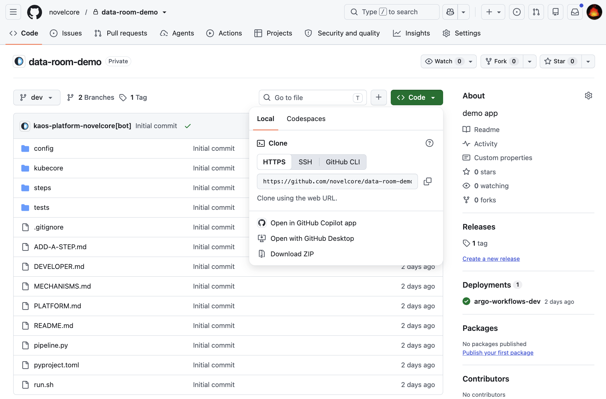
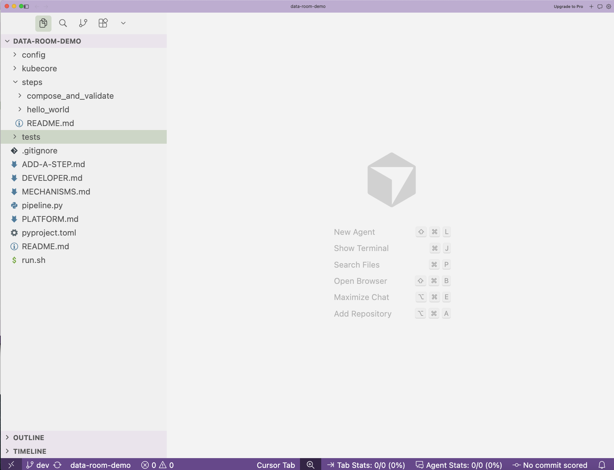

# Get the project

Now you will copy the project from GitHub onto your computer. This is called cloning. You do it once.

## Step 1. Find the project address

Open the project page on GitHub in your browser. Your Novelcore contact will send you the link. It looks like this:

```
https://github.com/novelcore/your-project-name
```

Click the green **Code** button near the top right. A small box opens. Copy the HTTPS address it shows.



## Step 2. Open your Terminal

You met the Terminal on the last page. Open it again.

- On a Mac, press `Cmd` and `Space`, type `Terminal`, press `Enter`.
- On Windows, open `Git Bash`.

## Step 3. Choose where the project should live

Pick a folder for your projects. This command makes one called `Projects` in your home folder and moves into it. Type it and press `Enter`.

```bash
mkdir -p ~/Projects && cd ~/Projects
```

## Step 4. Clone the project

Type `git clone`, then a space, then paste the address you copied. It looks like this:

```bash
git clone https://github.com/novelcore/your-project-name.git
```

Press `Enter`. Git downloads the project. You will see a few lines of progress. When it stops, it is done.

## Step 5. Open it in your editor

Move into the new folder and open it in Visual Studio Code.

```bash
cd your-project-name
code .
```

That last command is `code` then a space then a dot. The dot means this folder. Visual Studio Code opens with your project on the left.



## What you are looking at

You will see a handful of files and folders. Here are the ones that matter to you.

| Name | What it is |
|---|---|
| `pipeline.py` | Your list of steps and their order. |
| `config/` | Your settings. Every setting here becomes a field on the run page. |
| `steps/` | One folder per step. Your step code lives here. |
| `kubecore/` | The platform engine. Do not touch this. |

That is the whole layout. Next, a short read on how it all fits together. Go to [How it works](how-it-works.md).
