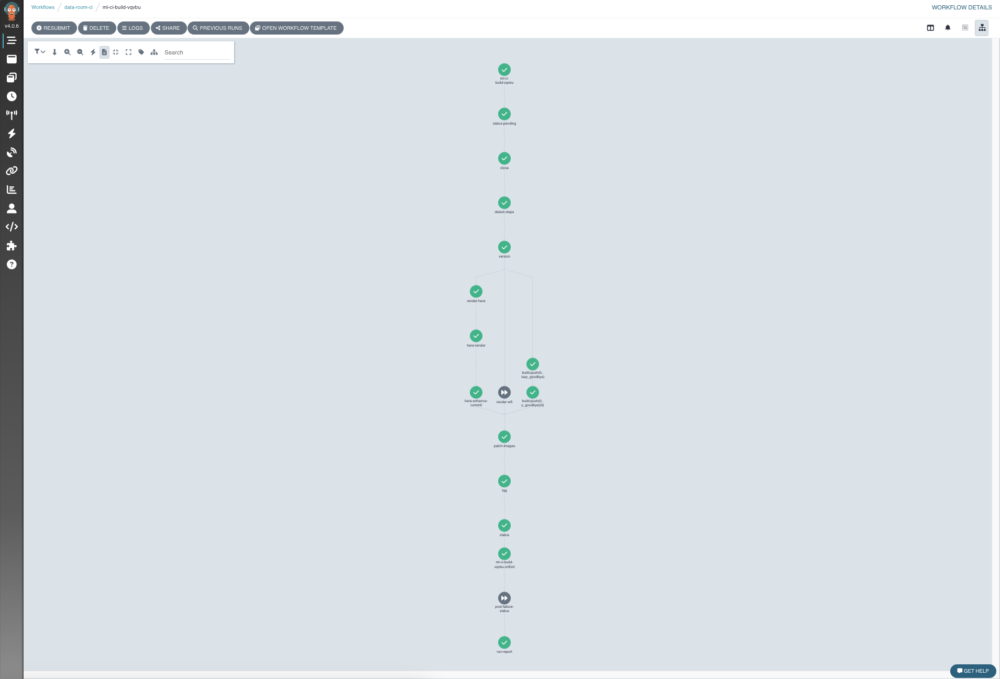

# Go live

Your pull request has a green tick. Now you make it real. This is called merging.

## Step 1. Merge the pull request

On the pull request page, click the green **Merge pull request** button. Then click **Confirm merge**.

That is your part done. Really. From here the platform takes over.

!!! note "Not sure if you should merge?"
    If someone on your team reviews changes first, wait for their go ahead. When in doubt, ask your Novelcore contact before you merge. Merging is easy to do and there is no rush.

## Step 2. Let the platform build

The moment you merge, the platform starts a build. It does two things.

- It builds any step whose code changed into a fresh image.
- It releases a new version of your pipeline with your change in it.

You will see a check on the merge called **`kubecore-ml-ci`**. It shows a yellow dot while it builds, then a green tick when it is done. This usually takes a few minutes.

??? note "Curious what happens behind the scenes?"
    Again, you never have to watch this. But this is the platform building your new step and releasing the pipeline. Every green tick is one part of that work done for you.

    

## Step 3. Your change is ready to run

When the build tick turns green, your new step or your new setting is live. It is now on the run page, waiting for you to press Submit.

Notice what you did not do. You did not build an image by hand. You did not pick a machine. You did not type a single password or server address. You edited a few small files and merged a request. The platform did the rest.

Now go run it. Go to [Run your pipeline](run-it.md).
