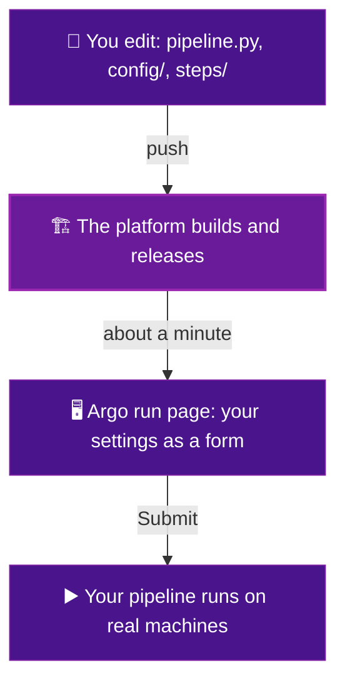

# How it works

This page has no tasks. It is a short read so the rest of the guide makes sense. Five minutes and you will get the whole idea.

## Three files, three jobs

- :material-file-tree: **`pipeline.py`**

    ---

    Your list of steps. It says what the steps are and what order they run in. Nothing else.

- :material-tune-vertical: **`config/`**

    ---

    Your settings. Each one turns into a field on the run page that a person can change.

- :material-package-variant-closed: **`steps/`**

    ---

    Your code. One folder per step, each with a small program and a Dockerfile.

That is the whole thing you own. Everything else is the platform.

## What the platform does for you

When you send your files in, the platform takes over. You do not set any of this up.

- It builds each step into an image, which is a small self contained box.
- It reads your `config/` and turns every setting into a field on a web page.
- It picks the right machine for each step, with or without a graphics card.
- It hands your steps the passwords they need to reach storage and tracking.
- It checks your work and tells you on GitHub if something is off.

You describe what you want. The platform figures out how to run it.

## What happens when you push

The values you set on the form get combined with your settings into one file before anything heavy runs. Every step receives that file. It is also saved, so any run can be repeated exactly.

## The one rule worth remembering

!!! quote "Remember this"
    You describe **what** each step is. The platform handles **how** it runs.

You never write a server address. You never write a password. You never pick a machine by hand. You say what your step needs, and the platform wires it up.

Ready to build something. Go to [Add a step](add-a-step.md).
