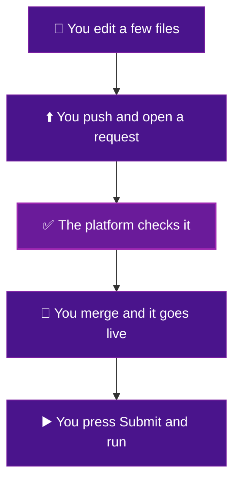

# Welcome

This is your guide to building a **Hera pipeline** from this template.

A pipeline is just a list of steps that run in order. One step prepares some data. The next step trains a model. Another step saves the result. You decide what the steps are. You decide the order. You write it in Python, using a small library called Hera. Do not worry about that name. This guide shows you the few lines you need, and nothing more.

The good news is simple. You describe the steps in plain files. You push those files. The platform does the hard part for you. It builds each step. It puts your settings on a web page with dropdowns. It runs the whole thing on real machines. You never touch servers or Kubernetes.

## The loop you will repeat

You start at the top and work down. The platform handles the middle. You press Submit at the end. Every page in this guide is one part of this loop.

## What you will be able to do

- :material-book-open-variant: **Start here**

    ---

    Set up your computer and get the project. First time through, read these in order.

    [:octicons-arrow-right-24: What you need](what-you-need.md)

- :material-plus-box: **Add a step**

    ---

    The main event. Make a folder, write a small program, add one line.

    [:octicons-arrow-right-24: Add a step](add-a-step.md)

- :material-tune: **Change a setting**

    ---

    Add a value people can change on the run page. One line does it.

    [:octicons-arrow-right-24: Change a setting](change-a-setting.md)

- :material-play-circle: **Run your pipeline**

    ---

    Open the web form, set a field or two, and press Submit.

    [:octicons-arrow-right-24: Run your pipeline](run-it.md)

- :material-lifebuoy: **When something breaks**

    ---

    Common problems and the plain fix for each one.

    [:octicons-arrow-right-24: Troubleshooting](troubleshooting.md)

- :material-book-alphabet: **Word list**

    ---

    Every term in this guide, explained in one sentence.

    [:octicons-arrow-right-24: Word list](glossary.md)

## Who this is for

You do not need to be an engineer. If you can edit a text file and follow steps in order, you can do this. Start with [What you need](what-you-need.md).
