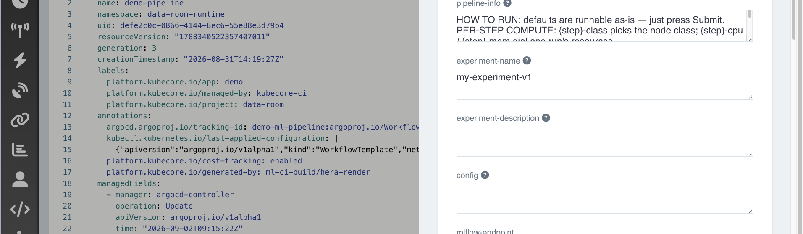
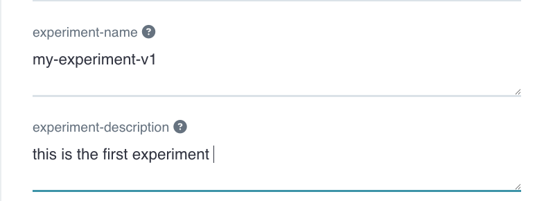
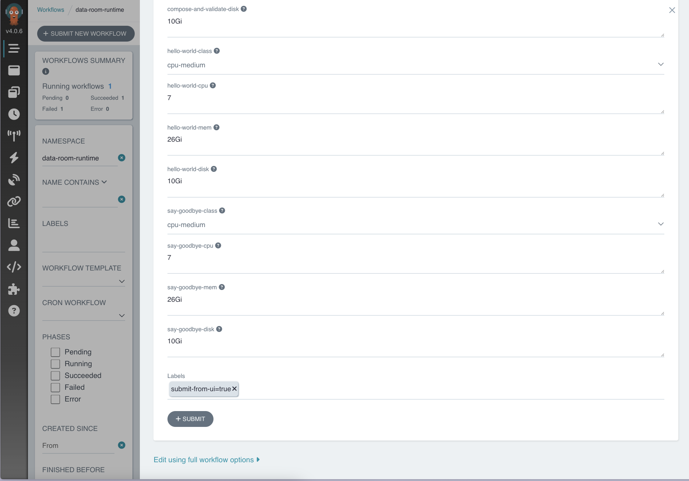
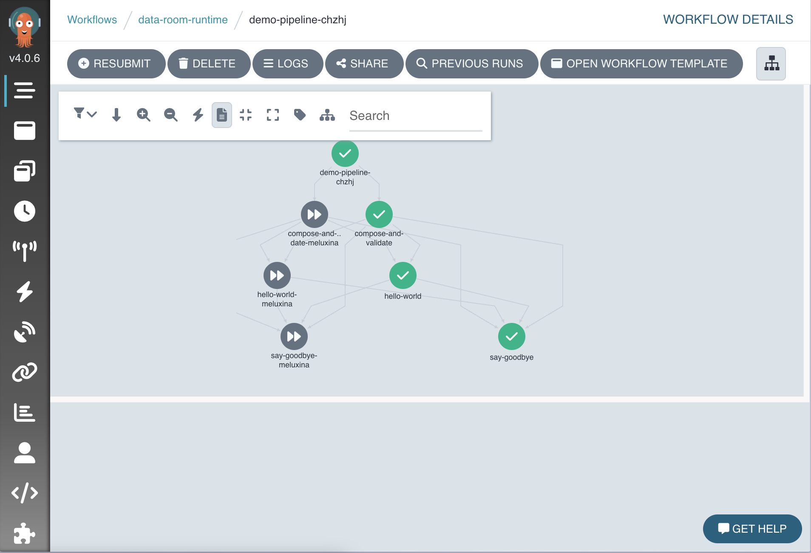

# Run your pipeline

This is the payoff. You open a web page, set a few fields, and press Submit. The platform runs your whole pipeline on real machines.

## Step 1. Open the run page

Your Novelcore contact will give you a link to the Argo web page. This page is run by a tool called Argo Workflows. You do not need to learn it. Open the link in your browser. This is where pipelines are run.

Find your pipeline in the list. It is named after your project, with `-pipeline` on the end. Click it, then look for the **Submit** button.

## Step 2. Read the form

When you click Submit, a form opens. Every field on this form came from your `config/` folder. This is the same tree you edited, now as a page you can fill in.

You will see fields like these.

- `experiment-name` and any other settings you added.
- Dropdowns the platform fills in for you, like which dataset to use.
- Sizing fields for each step, so you can ask for a smaller run.

Scroll down and you also see a sizing field for each step. You can ask for a smaller run here.

The first field is a read only note with a short summary. Leave it as it is.

## Step 3. Set what you want, or change nothing

You can press Submit right away. The defaults are ready to run as they are. Or change a field or two first. For a quick test, set a small number of rounds, or pick a smaller size.

## Step 4. Press Submit

Click **Submit**. The page switches to a live view of your run. Each step shows up as a box. A box turns green when its step finishes.

## Step 5. Watch it finish

Watch the boxes go green in order. If a step fails, its box turns red. Click the red box to read its log. The log tells you what went wrong.

That is the full loop. You edited files. You sent them in. You merged. You ran it. 

## Where results go

Depending on what your steps do, results land in a couple of places.

- Numbers and charts from a run go to a tracking page called MLflow. Your contact can give you the link.
- Files and datasets go to storage. Your steps read and write them using addresses the platform hands them.

You do not manage any of that plumbing. Your steps ask for what they need, and the platform provides it.

If a run does not behave, the next page has the common fixes. Go to [When something breaks](troubleshooting.md).
