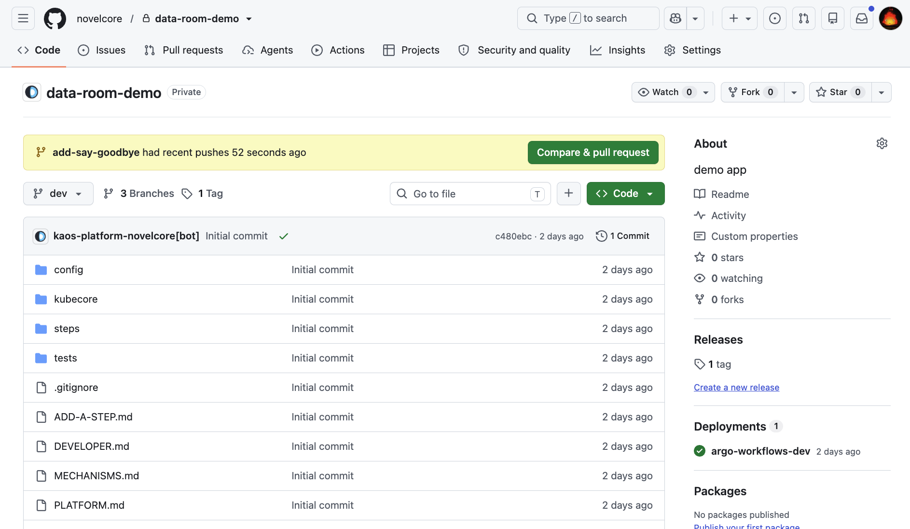
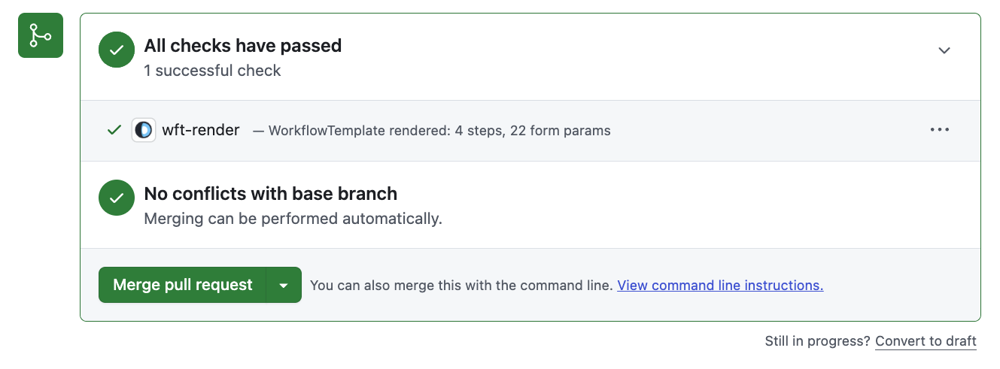
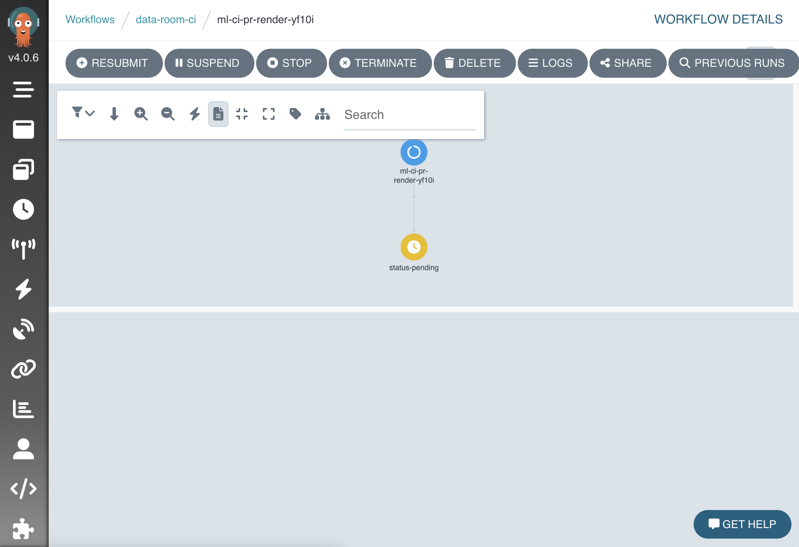

# Send your change in

You edited some files. They are still only on your computer. Now you will send them to GitHub and ask for them to be added to the project. This ask is called a pull request.

Do not worry about breaking anything. A pull request changes nothing on its own. It is a proposal. The platform checks it first and shows you a tick or a cross.

## Step 1. Make a branch

A branch is a safe copy to work on. You give it a short name that says what you did.

```bash
git checkout -b add-say-goodbye
```

You are now on a branch called `add-say-goodbye`. Your changes will live here until they are accepted.

## Step 2. Stage and save your changes

Tell Git which files to include, then save them with a short message.

```bash
git add .
git commit -m "add say-goodbye step"
```

The `git add .` line adds everything you changed. The `git commit` line saves it with a note. Keep the note short and plain.

## Step 3. Push the branch to GitHub

```bash
git push -u origin add-say-goodbye
```

This sends your branch up to GitHub. After it finishes, Git often prints a link you can click to open the pull request. If it does, click it and skip to Step 5.

## Step 4. Open the pull request

Go to the project page on GitHub in your browser. GitHub usually shows a yellow banner with a button that says **Compare & pull request**. Click it.

If you do not see the banner, click the **Pull requests** tab, then the green **New pull request** button, and pick your branch.



Give it a short title. Add a sentence about what you did. Then click **Create pull request**.

## Step 5. Wait for the check

Now the platform gets to work. On your pull request you will see a check appear. It is called **`wft-render`**.

- While it runs, it shows a yellow dot. This takes a couple of minutes.
- If your work is valid, it turns into a green tick.
- If something is off, it turns into a red cross.



## What the check is actually doing

The check builds a preview of your pipeline using the real project settings. It confirms a few things for you.

- Your steps are wired up correctly.
- Every step reads settings that actually exist.
- Every step has a Dockerfile the platform can build.

Nothing is deployed at this stage. The check only looks. It is a safety net before anything real happens.

??? note "Curious what happens behind the scenes?"
    You never have to look at this. But if you are curious, the check runs a small job on the platform that renders your pipeline. If you click the check and follow its link, you land on a live view like the one below. Green means the render finished.

    

## If the check fails

Do not panic. A red cross is normal and helpful. Click the word **Details** next to the check. It opens a page with the reason. The message names the exact problem, like a step that is missing its Dockerfile, or a setting that does not exist.

Fix the one thing it names. Then push again.

```bash
git add .
git commit -m "fix the thing the check named"
git push
```

The check runs again on its own. You do not open a new pull request. The same one updates.

When you see the green tick, you are ready for the last step. Go to [Go live](go-live.md).
